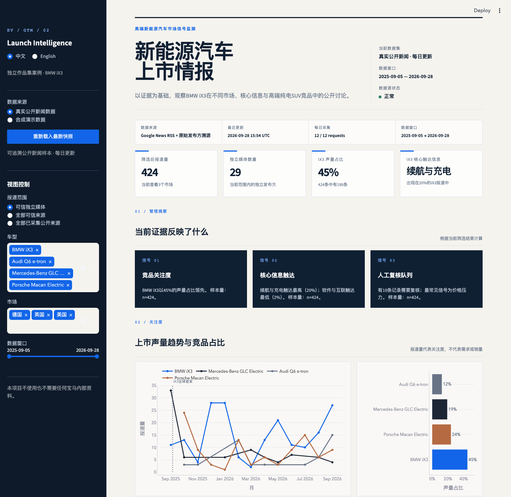
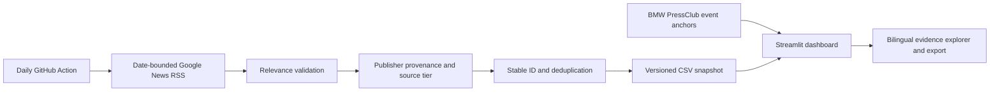

# EV Launch Intelligence V2

A bilingual, evidence-first Streamlit dashboard for monitoring how the BMW iX3 is discussed across overseas public news, priority product messages, and premium electric-SUV competitors.

> Independent portfolio project. It is not affiliated with or endorsed by BMW Group and contains no private BMW information.



## What changed in V2

- Chinese/English interface switching across controls, metrics, charts, analytical labels, methodology, and CSV exports.
- A real public-news snapshot from the BMW iX3 world premiere on **5 September 2025** through the latest successful daily collection.
- 2,588 traceable real records in the included 28 September 2026 snapshot.
- Publisher provenance, source tiers, collection timestamps, stable record IDs, and idempotent deduplication.
- Daily incremental collection with a 48-hour overlap window.
- Source-health, freshness, and stale-snapshot indicators.
- A scheduled GitHub Actions workflow for daily refreshes.
- The synthetic dataset remains available as a separate offline demonstration and never mixes with real records.

## Product questions

1. How much public-news attention does the iX3 receive relative to selected competitors?
2. Which iX3 messages appear in curated independent coverage?
3. How does message pull-through vary across UK, German, and US Google News locales?
4. Which critical lexical signals deserve human review?
5. Can every calculated signal be traced to a publisher, timestamp, and evidence link?

## Real data sources

### Daily and historical discovery

The current production dataset uses date-bounded **Google News RSS** queries. Every record preserves:

- the underlying publisher name and homepage supplied by the feed,
- the Google News evidence link,
- publication and collection timestamps,
- product query and discovery-market locale,
- provider and source-quality tier.

The `market` field identifies the Google News locale used for discovery; it does not guarantee the publisher's headquarters or the audience's physical location.

### Verified launch anchors

The iX3 world-premiere anchor comes from BMW Group PressClub. Verified official events are stored separately in `data/official_events.csv` and are not mixed into independent-media KPIs.

### Why GDELT is not active in V2

GDELT was evaluated for historical discovery, but the live validation request returned HTTP 429. It is therefore documented as a possible future provider rather than represented as an active or dependable production source.

## Source quality tiers

| Tier | Default KPI use | Meaning |
|---|---:|---|
| Official | Optional | Verified brand newsroom or official media domain |
| Curated independent | Yes | Recognised editorial automotive, technology, business, or news publisher |
| Unverified public | No | Traceable public result retained for inspection but excluded from default KPIs |

The source allowlist is intentionally transparent in `src/data_pipeline.py`. Coverage is a traceable public-news sample, not exhaustive global media monitoring.

## Metrics and boundaries

- **Share of voice:** record-count share inside the selected evidence set; not sales, demand, or market share.
- **Message pull-through:** share of selected iX3 records matching a transparent multi-label product-message dictionary.
- **Tone and risk:** lexical review-prioritisation heuristics; not consumer sentiment.
- **Market comparison:** comparison of discovery locales, not a claim about all national media.
- One article may appear in more than one market locale when it is independently surfaced by those feeds.

## Architecture



## Run locally

```bash
python -m venv .venv
source .venv/bin/activate
pip install -r requirements.txt
streamlit run app.py
```

The local Streamlit process opens a browser automatically. The real public-news snapshot is the default data source.

## Collect data

Daily incremental update:

```bash
python -m scripts.collect_news --mode daily
python -m scripts.validate_dataset
```

Rebuild from the launch date:

```bash
python -m scripts.collect_news \
  --mode backfill \
  --start 2025-09-05 \
  --chunk-months 3 \
  --limit 100
python -m scripts.validate_dataset
```

The collector writes atomically: a failed run does not overwrite the last successful snapshot.

## Enable the daily schedule

The workflow at `.github/workflows/update-news.yml` runs at **06:15 UTC daily** and can also be triggered manually. It becomes active after this project is pushed to a GitHub repository with Actions enabled and workflow `contents: write` permission.

## Test

```bash
pip install -r requirements-dev.txt
pytest -q
ruff check .
playwright install chromium
```

With Streamlit running locally:

```bash
python tests/smoke_test_ui.py
```

## Repository map

```text
gtm-intelligence-tool/
├── .github/workflows/update-news.yml
├── app.py
├── assets/
│   ├── dashboard-preview.png
│   └── styles.css
├── data/
│   ├── collection_status.json
│   ├── demo_mentions.csv
│   ├── official_events.csv
│   └── public_coverage.csv
├── scripts/
│   ├── collect_news.py
│   └── validate_dataset.py
├── src/
│   ├── analysis.py
│   ├── data_pipeline.py
│   ├── feed_client.py
│   └── i18n.py
└── tests/
```
